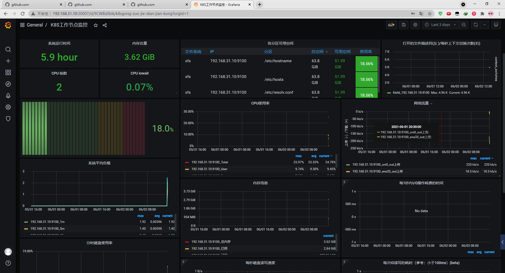
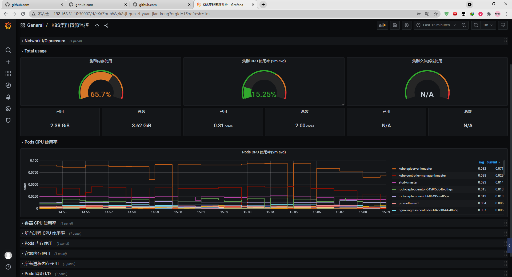
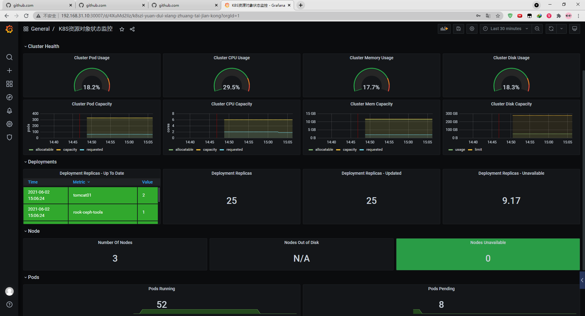

# Promethues与Grafana用nfs持久部署


## kubernetes集群环境


```
[root@kmaster prometheus]# kubectl get node -o wide
NAME      STATUS     ROLES                  AGE   VERSION   INTERNAL-IP     EXTERNAL-IP   OS-IMAGE        KERNEL-VERSION               CONTAINER-RUNTIME
kmaster   Ready      control-plane,master   21d   v1.21.0   192.168.31.10   <none>        Rocky Linux 8   4.18.0-240.22.1.el8.x86_64   docker://20.10.6
knode01   Ready      <none>                 21d   v1.21.0   192.168.31.11   <none>        Rocky Linux 8   4.18.0-240.22.1.el8.x86_64   docker://20.10.6
knode02   Ready      <none>                 21d   v1.21.0   192.168.31.12   <none>        Rocky Linux 8   4.18.0-240.22.1.el8.x86_64   docker://20.10.6
[root@kmaster prometheus]# 
```

## 安装nfs服务（k8s所有节点安装）

```
#安装nfs
yum -y install nfs-utils
#启动nfs服务
systemctl start nfs && systemctl enable nfs
#Rockylinux
systemctl start nfs-server && systemctl enable nfs-server
```

### 设置NFS server

> 可以用任意的节点做nfs server端

```
# 配置nfs server路径配置文件
[root@kmaster prometheus]# cat > /etc/exports << EOF
> /mnt *(rw,no_root_squash)
> EOF
[root@kmaster prometheus]# cat /etc/exports
/mnt *(rw,no_root_squash)
[root@kmaster prometheus]#

# 重启nfs server
systemctl restart nfs-server

# 创建挂载路径
[root@kmaster prometheus]# mkdir -pv /mnt/kubernetes
mkdir: created directory '/mnt/kubernetes'
[root@kmaster prometheus]#
```


### 上传yaml文件


```
[root@kmaster prometheus]# ls nfs-client
class.yaml  deployment.yaml  rbac.yaml
[root@kmaster prometheus]#
```

```
[root@kmaster nfs-client]# cat class.yaml 
apiVersion: storage.k8s.io/v1
kind: StorageClass
metadata:
  name: managed-nfs-storage
provisioner: fuseim.pri/ifs # or choose another name, must match deployment's env PROVISIONER_NAME'
parameters:
  archiveOnDelete: "true"
[root@kmaster nfs-client]#
```

```
image: quay.io/external_storage/nfs-client-provisioner:latest镜像国内拉取不下来
[root@kmaster nfs-client]# cat deployment.yaml 
apiVersion: v1
kind: ServiceAccount
metadata:
  name: nfs-client-provisioner
---
kind: Deployment
apiVersion: apps/v1 
metadata:
  name: nfs-client-provisioner
spec:
  replicas: 1
  strategy:
    type: Recreate
  selector:
    matchLabels:
      app: nfs-client-provisioner
  template:
    metadata:
      labels:
        app: nfs-client-provisioner
    spec:
      serviceAccountName: nfs-client-provisioner
      containers:
        - name: nfs-client-provisioner
          image: quay.io/external_storage/nfs-client-provisioner:latest
          volumeMounts:
            - name: nfs-client-root
              mountPath: /persistentvolumes
          env:
            - name: PROVISIONER_NAME
              value: fuseim.pri/ifs
            - name: NFS_SERVER
              value: 192.168.31.10 
            - name: NFS_PATH
              value: /mnt/kubernetes
      volumes:
        - name: nfs-client-root
          nfs:
            server: 192.168.31.10
            path: /mnt/kubernetes
[root@kmaster nfs-client]# 
```

```
[root@kmaster nfs-client]# cat rbac.yaml 
kind: ServiceAccount
apiVersion: v1
metadata:
  name: nfs-client-provisioner
---
kind: ClusterRole
apiVersion: rbac.authorization.k8s.io/v1
metadata:
  name: nfs-client-provisioner-runner
rules:
  - apiGroups: [""]
    resources: ["persistentvolumes"]
    verbs: ["get", "list", "watch", "create", "delete"]
  - apiGroups: [""]
    resources: ["persistentvolumeclaims"]
    verbs: ["get", "list", "watch", "update"]
  - apiGroups: ["storage.k8s.io"]
    resources: ["storageclasses"]
    verbs: ["get", "list", "watch"]
  - apiGroups: [""]
    resources: ["events"]
    verbs: ["create", "update", "patch"]
---
kind: ClusterRoleBinding
apiVersion: rbac.authorization.k8s.io/v1
metadata:
  name: run-nfs-client-provisioner
subjects:
  - kind: ServiceAccount
    name: nfs-client-provisioner
    namespace: default
roleRef:
  kind: ClusterRole
  name: nfs-client-provisioner-runner
  apiGroup: rbac.authorization.k8s.io
---
kind: Role
apiVersion: rbac.authorization.k8s.io/v1
metadata:
  name: leader-locking-nfs-client-provisioner
rules:
  - apiGroups: [""]
    resources: ["endpoints"]
    verbs: ["get", "list", "watch", "create", "update", "patch"]
---
kind: RoleBinding
apiVersion: rbac.authorization.k8s.io/v1
metadata:
  name: leader-locking-nfs-client-provisioner
subjects:
  - kind: ServiceAccount
    name: nfs-client-provisioner
    # replace with namespace where provisioner is deployed
    namespace: default
roleRef:
  kind: Role
  name: leader-locking-nfs-client-provisioner
  apiGroup: rbac.authorization.k8s.io
[root@kmaster nfs-client]# 
```


### 修改配置文件

```
# 修改实际配置文件deployment.yaml
              value: 192.168.31.10		#修改实际nfs server地址
            - name: NFS_PATH
              value: /mnt/kubernetes	#修改实际路径
      volumes:
        - name: nfs-client-root
          nfs:
            server: 192.168.31.10		#修改实际nfs server地址
            path: /mnt/kubernetes 		#修改实际路径
```

### 设置集群标签

```
[root@kmaster prometheus]# kubectl label nodes kmaster k8s-app=prometheus
node/kmaster labeled
[root@kmaster prometheus]# kubectl label nodes knode01 k8s-app=prometheus
node/knode01 labeled
[root@kmaster prometheus]# kubectl label nodes knode02 k8s-app=prometheus
node/knode02 labeled
[root@kmaster prometheus]#
```

### 部署nfs pv

```
[root@kmaster prometheus]# kubectl apply -f nfs-client
storageclass.storage.k8s.io/managed-nfs-storage created
serviceaccount/nfs-client-provisioner created
deployment.apps/nfs-client-provisioner created
serviceaccount/nfs-client-provisioner unchanged
clusterrole.rbac.authorization.k8s.io/nfs-client-provisioner-runner created
clusterrolebinding.rbac.authorization.k8s.io/run-nfs-client-provisioner created
role.rbac.authorization.k8s.io/leader-locking-nfs-client-provisioner created
rolebinding.rbac.authorization.k8s.io/leader-locking-nfs-client-provisioner created
[root@kmaster prometheus]#

#查看pod运行
[root@kmaster prometheus]# kubectl get pod -A |grep nfs
default         nfs-client-provisioner-66795cb958-b4hwk             1/1     Running            0          35s
[root@kmaster prometheus]#
```


## 部署prometheus

```
[root@kmaster prometheus]# ls prometheus
alertmanager-configmap.yaml   alertmanager-service.yaml  grafana仪表盘                       kube-state-metrics-service.yaml  prometheus-configmap.yaml  prometheus-service.yaml
alertmanager-deployment.yaml  ansible_node_exporter      kube-state-metrics-deployment.yaml  node-exporter-ds.yml             prometheus-rbac.yaml       prometheus-statefulset.yaml
alertmanager-pvc.yaml         grafana.yaml               kube-state-metrics-rbac.yaml        node-exporter-service.yaml       prometheus-rules.yaml
[root@kmaster prometheus]#
```

### 配置对应文件

````
vim prometheus/prometheus-configmap.yaml
    scrape_configs:
    - job_name: kubernetes-nodes
      static_configs:
      - targets:
        - 192.168.31.10:9100
        - 192.168.31.11:9100
        - 192.168.31.12:9100
````

### 部署Prometheus

```
[root@kmaster prometheus]# kubectl apply -f prometheus/prometheus-*.yml
error: the path "prometheus/prometheus-*.yml" does not exist
[root@kmaster prometheus]# kubectl apply -f prometheus/prometheus-configmap.yaml 
configmap/prometheus-config created
[root@kmaster prometheus]# kubectl apply -f prometheus/prometheus-rbac.yaml 
serviceaccount/prometheus created
Warning: rbac.authorization.k8s.io/v1beta1 ClusterRole is deprecated in v1.17+, unavailable in v1.22+; use rbac.authorization.k8s.io/v1 ClusterRole
clusterrole.rbac.authorization.k8s.io/prometheus created
Warning: rbac.authorization.k8s.io/v1beta1 ClusterRoleBinding is deprecated in v1.17+, unavailable in v1.22+; use rbac.authorization.k8s.io/v1 ClusterRoleBinding
clusterrolebinding.rbac.authorization.k8s.io/prometheus created
[root@kmaster prometheus]# kubectl apply -f prometheus/prometheus-rules.yaml 
configmap/prometheus-rules created
[root@kmaster prometheus]# kubectl apply -f prometheus/prometheus-service.yaml 
service/prometheus created
[root@kmaster prometheus]# kubectl apply -f prometheus/prometheus-statefulset.yaml 
statefulset.apps/prometheus created
[root@kmaster prometheus]# 
```

> 错误pvc一直处于pending状态
>
> 
>
> 解决方案：
>
> https://www.jianshu.com/p/771d5d16662d
>
> 在/etc/kubernetes/manifests/kube-apiserver.yaml增加\- --feature-gates=RemoveSelfLink=false
>
> https://github.com/kubernetes-sigs/nfs-subdir-external-provisioner/issues/25

````
位置
spec:
  containers:
  - command:
    - kube-apiserver
    - --feature-gates=RemoveSelfLink=false

#修改后执行
[root@kmaster prometheus]# kubectl apply -f /etc/kubernetes/manifests/kube-apiserver.yaml 
pod/kube-apiserver created
[root@kmaster prometheus]# 
````

错误状态

```
[root@kmaster prometheus]# kubectl get pvc -A
NAMESPACE     NAME                           STATUS    VOLUME   CAPACITY   ACCESS MODES   STORAGECLASS          AGE
kube-system   alertmanager                   Pending                                      managed-nfs-storage   35m
kube-system   prometheus-data-prometheus-0   Pending                                      managed-nfs-storage   24m
[root@kmaster prometheus]#
```


错误日志
````
[root@kmaster prometheus]# kubectl logs -f nfs-client-provisioner-66795cb958-5lmlf
I0602 05:06:59.398450       1 leaderelection.go:185] attempting to acquire leader lease  default/fuseim.pri-ifs...
E0602 05:07:16.847729       1 event.go:259] Could not construct reference to: '&v1.Endpoints{TypeMeta:v1.TypeMeta{Kind:"", APIVersion:""}, ObjectMeta:v1.ObjectMeta{Name:"fuseim.pri-ifs", GenerateName:"", Namespace:"default", SelfLink:"", UID:"94b2b6c4-9b70-458f-9f76-0ca113514e47", ResourceVersion:"43723", Generation:0, CreationTimestamp:v1.Time{Time:time.Time{wall:0x0, ext:63758203956, loc:(*time.Location)(0x1956800)}}, DeletionTimestamp:(*v1.Time)(nil), DeletionGracePeriodSeconds:(*int64)(nil), Labels:map[string]string(nil), Annotations:map[string]string{"control-plane.alpha.kubernetes.io/leader":"{\"holderIdentity\":\"nfs-client-provisioner-66795cb958-5lmlf_5c135e82-c360-11eb-ac73-9a321326222e\",\"leaseDurationSeconds\":15,\"acquireTime\":\"2021-06-02T05:07:16Z\",\"renewTime\":\"2021-06-02T05:07:16Z\",\"leaderTransitions\":1}"}, OwnerReferences:[]v1.OwnerReference(nil), Initializers:(*v1.Initializers)(nil), Finalizers:[]string(nil), ClusterName:""}, Subsets:[]v1.EndpointSubset(nil)}' due to: 'selfLink was empty, can't make reference'. Will not report event: 'Normal' 'LeaderElection' 'nfs-client-provisioner-66795cb958-5lmlf_5c135e82-c360-11eb-ac73-9a321326222e became leader'
I0602 05:07:16.847812       1 leaderelection.go:194] successfully acquired lease default/fuseim.pri-ifs
I0602 05:07:16.847852       1 controller.go:631] Starting provisioner controller fuseim.pri/ifs_nfs-client-provisioner-66795cb958-5lmlf_5c135e82-c360-11eb-ac73-9a321326222e!
I0602 05:07:16.950434       1 controller.go:680] Started provisioner controller fuseim.pri/ifs_nfs-client-provisioner-66795cb958-5lmlf_5c135e82-c360-11eb-ac73-9a321326222e!
I0602 05:09:29.903677       1 controller.go:987] provision "kube-system/prometheus-data-prometheus-0" class "managed-nfs-storage": started
E0602 05:09:29.906093       1 controller.go:1004] provision "kube-system/prometheus-data-prometheus-0" class "managed-nfs-storage": unexpected error getting claim reference: selfLink was empty, can't make reference
````

### 访问Prometheus

````
http://192.168.31.10:30090/
````


## 部署grafana
```
[root@kmaster prometheus]# kubectl apply -f grafana.yaml 
statefulset.apps/grafana created
service/grafana created
[root@kmaster prometheus]# 
```

### 添加监控node节点

```
[root@kmaster prometheus]# kubectl apply -f node-exporter-ds.yml 
daemonset.apps/node-exporter created
[root@kmaster prometheus]# 

```

### 添加master节点监控

```
[root@kmaster prometheus]# kubectl apply -f kube-state-metrics-deployment.yaml 
deployment.apps/kube-state-metrics created
configmap/kube-state-metrics-config created
[root@kmaster prometheus]# kubectl apply -f kube-state-metrics-rbac.yaml 
serviceaccount/kube-state-metrics created
clusterrole.rbac.authorization.k8s.io/kube-state-metrics created
role.rbac.authorization.k8s.io/kube-state-metrics-resizer created
clusterrolebinding.rbac.authorization.k8s.io/kube-state-metrics created
rolebinding.rbac.authorization.k8s.io/kube-state-metrics created
[root@kmaster prometheus]# kubectl apply -f kube-state-metrics-service.yaml 
service/kube-state-metrics created
[root@kmaster prometheus]#
```

### 新增data source

在master节点查看promethues svc,通过promethues svc名字和端口就可以连接
```
[root@kmaster prometheus]# kubectl get svc -n kube-system |grep pro
prometheus           NodePort    10.104.140.107   <none>        9090:30090/TCP           24m
[root@kmaster prometheus]# 
```


# 效果图






